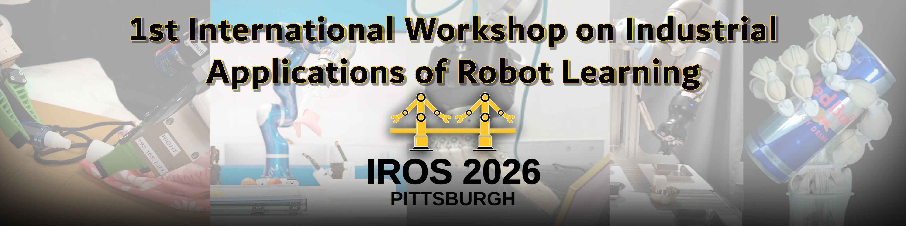

---
# Feel free to add content and custom Front Matter to this file.
# To modify the layout, see https://jekyllrb.com/docs/themes/#overriding-theme-defaults

permalink: /
title: Home
layout: home
---
<!--Edit to prefrence -->
<!-- Hide the default page title "Home" but keep it in the front matter for the navigation menu -->

<!-- #  **1st International Workshop on Industrial Applications of Robot Learning** -->  <!-- Header1 -->

 

### <strong>About</strong>                            
Robot Learning is ready to leave the lab and go into industry as proven by the recent wave of Embodied AI and Physical AI startups jointly attracting billions of dollars in investment. Over the past decade, advances in deep reinforcement learning, imitation learning, large-scale simulation, and foundation models have enabled robots to learn tasks from data and operate in less structured environments. Unlike traditional industrial robots that depend on rigid programming and controlled settings, these systems promise greater autonomy and adaptability for real-world deployment. In this workshop we will discuss the state-of-the-art in industrial applications of robot learning with speakers working on the frontlines both in industry and in academia. Motivated by the global importance of this transition, efforts are underway worldwide, including startup- and industry-driven projects in the US, large-scale programs across Europe, such as Robust and Trustworthy Generative AI for Robotics and Industrial Automation (RIA), and projects in Asia, including JST and NEDO initiatives in Japan supporting learning-based industrial robotics. As robot learning approaches real-world deployment, this workshop will foster discussion on a central question for industry: whether robot learning is ready to meet the high standards of precision, reliability, safety, and robustness in industrial applications, and how to bridge the remaining gaps to achieve them.

Topics of Interest include (but are not limited to):
<ul>
    <li>Industrial applications of robot learning</li>
    <li>Learning visual, force, tactile, and audio perception</li> 
    <li>Learning dexterous manipulation</li>
    <li>Learning-based manipulation and long-horizon task execution</li> 
    <li>Sim-to-real transfer and data-efficient learning</li>
    <li>Foundation models and generative AI for industrial robots</li>
    <li>Human-robot collaboration and adaptive shared autonomy</li>
    <li>Benchmarking and evaluation of precision, reliability, and performance</li>
    <li>Safety, trustworthiness, and robustness in learning-enabled industrial robots</li>
</ul>

### <strong>Speakers and Panelists</strong> {#speakers}

    

        <a href="https://contactrika.github.io/" target="_blank"> 
            
            
Rika Antonova

        </a>
        
University of Cambridge

    

    

        <a href="https://scholar.google.com/citations?user=mLFRRpkAAAAJ&hl=en" target="_blank">
            
            
Jose Barreiros

        </a>
        
TRI Amazon Robotics

    

    

        <a href="https://researchmap.jp/yukiyasu-domae" target="_blank">
            
            
Yukiyasu Domae

        </a>
        
AIST

    

    

        <a href="https://www.roboticmanipulation.org/members2/kensuke-harada/" target="_blank">
            
            
Kensuke Harada

        </a>
        
University of Osaka

    

    

        <a href="https://srl.ethz.ch/the-group/robert-katzschmann.html" target="_blank">
            
            
Robert Katzchmann

        </a>
        
ETH Zurich Mimic Robotics

    

    

        <a href=" https://robertomartinmartin.com/" target="_blank">
            
            
Roberto Martin-Martin

        </a>
        
UT Austin Amazon Robotics

    

    

        <a href="https://ogata-lab.jp/" target="_blank">
            
            
Tetsuya Ogata

        </a>
        
Waseda University

    

    

        <a href="https://loop.frontiersin.org/people/128233/bio" target="_blank">
            
            
Máximo A. Roa

        </a>
        
German Aerospace Center

    

    

        <a href="https://users.wpi.edu/~jxiao2/" target="_blank">
            
            
Jing Xiao

        </a>
        
Worcester Polytechnic Institute

    

    

        <a href="TBD" target="_blank">
            
            
Speaker 10

        </a>
        
TBD

    

### <strong>Important Information</strong> {#important-info}

    

        
📍

        

            
Venue

            
IROS 2026 · Pittsburgh

        

    

    

        
🖥️

        

            
Format

            
Hybrid: in-person + livestream; talks, spotlights, posters, panel

        

    

    

        
🏆

        

            
Awards

            
Best Paper ($1000), Best Student Paper ($1000), Best Poster Presentation ($500)

        

    

    

        
📅

        

            
Call for Papers

            
TBD

        

    

    

        
⏳

        

            
Submission Deadline

            
TBD

        

    

    

        
📧

        

            
Contact

            
TBD

        

    

    

        
🌐

        

            
Website

            
TBD

        

    

### Submission guidelines                   
We invite submissions of extended abstracts up to 2 pages (excluding references).  Accepted papers will be presented at the workshop as posters. Research award candidates will give 8-minute talks. All submissions will undergo a single-blind peer review process (via open review). 

### <strong>Organizers</strong> {#organizers}

    

        <a href="https://staff.aist.go.jp/floris.erich/" target="_blank">
            
            
Floris Erich

        </a>
        
AIST

    

    

        <a href="https://romanmykhailyshyn.github.io/" target="_blank">
            
            
Roman Mykhailyshyn

        </a>
        
AIST American University Kyiv

    

    

        <a herf="https://keiohta.github.io/" target="_blank">
            
            
Kei Ota

        </a>
        
AI Robot Association RIKEN

    

    

        <a href="https://chzjuou.github.io/" target="_blank">
            
            
Hao Chen

        </a>
        
University of Osaka

    

    

        <a href="https://www.merl.com/people/romeres" target="_blank">
            
            
Diego Romeres

        </a>
        
Mitsubishi Electric Research Laboratories

    

    

        <a href="https://sites.google.com/view/marinayaoyama/research" target="_blank">
            
            
Marina Y. Aoyama

        </a>
        
University of Edinburgh

    

### <strong>Supported by</strong>                           

    

        
    

    

        
    

    

        
    

    
TBD
       <!--  -->
    

<a href="#top" class="back-to-top">Back to Top</a>
